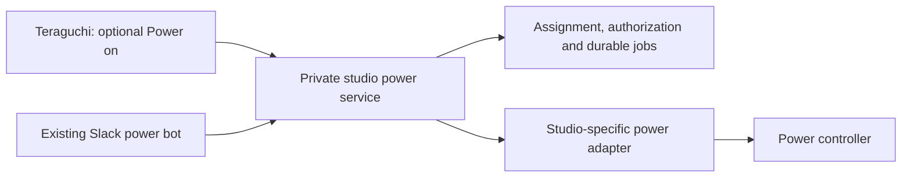

# Optional studio power integration

This is a P3 interface and integration proposal. The preview implements only
presentation and a simulated provider. No power service, Slack integration,
controller credentials, real status polling or power mutation is connected.

## Product behavior

A standard Teraguchi installation has no power controls. An administrator may
provision a trusted studio provider; artists cannot enable it with a preference.
The provider returns only workstations assigned to the authenticated artist and
the actions permitted for each one. Assignment is independent of whether a
workstation is online, so powered-off workstations remain in the list.

The artist sees one ordinary **Power on** action when starting is permitted,
then **Starting**, then **Available** after a separate PLANK availability check.
Connecting remains an explicit action and still runs strict session admission.
There is no artist-facing Power off, raw outlet selector or unconditional cycle.
A received power-command acknowledgement never proves the workstation is ready.

Keep these observations separate:

- Outlet off: the controller reports no mains power to that mapped outlet.
- Workstation off: a qualified source has established the machine is off.
- Outlet on, machine unknown: mains power exists, but the machine may be booting,
  running with a network fault, or shut down. A failed ping cannot distinguish them.
- Starting: a tracked start job or credible boot observation is in progress.
- Available: the remote workstation service is reachable; connecting still needs
  authentication, exclusive-seat and exact-video checks.

If the outlet is off and the mapping/policy permit starting, the studio provider
switches it on. If the outlet is on and the machine is **positively established
to be off**, the provider may use an administrator-enabled cycle-to-start policy.
The UI explains that the outlet may briefly cycle. Do not derive this permission
from a timeout, missing PLANK process, expired heartbeat, absent lease, failed
SSH connection or failed ping. If reliable off-state evidence is unavailable,
show an uncertain state and route recovery to studio support. A deliberate
administrator recovery action must name the target and disclose the power cut;
it is separate from artist self-service startup.

## Ownership and placement

The service must run on an always-on studio controller, not on a workstation it
needs to start. DXS can reuse its existing bot's Digital Loggers operations and
inventory in this private service. Slack and Teraguchi become two callers of the
same authorization, locking and recovery logic. The app does not post Slack
commands, need a Slack account, or receive the bot's or controller's credentials.
Slack availability must not be required for app startup requests. Notifications
are optional service output, not the command transport.

The public client knows stable workstation IDs, status and permitted actions.
Digital Loggers endpoints, outlet indices, credentials, identity mappings and
studio deployment remain private. Another studio may provide a different power
adapter, or none. No infrastructure repository becomes a product submodule or
build dependency. The inherited Relay wake path remains unchanged; its
connection-triggered OK/ERROR protocol is not a substitute for this service's
status, per-artist authorization or durable job tracking.

## Native UI adapter boundary

`WorkstationPicker.studioPower` defaults to null. A future trusted native adapter
provides `enabled`, `revision`, `pending`, `report(workstationId)`,
`requestStart(workstationId)` and `requestRefresh(workstationId)`.

A presentation report includes the matching `workstationId`, `state`, strict
boolean `fresh` and strict boolean `startAllowed`. States are `off`, `standby`
(verified off with mains power), `starting`, `online`, `unknown` or `unavailable`.
An optional `outlet` field is `on`, `off` or `unknown`; providers without outlet
telemetry omit it. Reports never carry an address, password or raw relay command.
These are in-process view inputs, not an implemented network protocol.

The adapter must latch `pending` synchronously before dispatch, resolve IDs
against current assignment, reject duplicates, and update `revision` when any
report changes. It must invalidate stale reports on a monotonic deadline and
remove start permission immediately on policy/authentication changes. The
initial freshness budget is at most 15 seconds, with authoritative checks
repeated by the server at dispatch. A refresh failure produces unknown status;
it does not erase workstation assignment or make a start permissible.

After a submission timeout, retain the operation identity and reconcile its
server-side job. Do not clear pending and blindly submit another cycle. Closing
the UI or removing assignment cannot undo a command already accepted by the
power controller; the service finishes/reconciles that job independently and
revokes further access. Multi-user concurrency must be enforced on the service,
not by the QML view's disabled buttons. Power results must not alter the
connection flow's generation, session ownership or authentication result.

## Private service implementation order

1. Extract pure status/action operations from the existing Slack handlers.
   Importing the library must not initialize Slack, read secrets, open a socket,
   or execute a power command. Keep the existing installation unchanged while
   tests run with a fake controller.
2. Add authenticated identity, assigned-target authorization and explicit
   `status`/`start` grants. Do not trust caller-supplied usernames, outlet numbers,
   addresses, or unsigned discovery data. Determine the shared client identity
   mechanism before any live action endpoint is enabled.
3. Add a persistent job ledger, a per-workstation lock, an idempotency key per
   logical request, and a configurable boot grace period. Repeated app or Slack
   requests attach to the existing start job. Reconcile uncertain controller
   outcomes after crashes instead of repeating a power cycle. The app gets
   sanitized job results; audit details stay in the studio service.
4. Qualify each target-to-outlet mapping, all power feeds, boot-on-AC behavior,
   controller on/cycle semantics and trustworthy off-state evidence. Prevent
   actions on shared infrastructure outlets or active/uncertain workstations.
   No startup implementation may depend on anonymous access or disabled TLS
   verification. Provision trusted controller certificates or an equivalently
   authenticated controller channel.
5. Add read-only status integration first, then start-job submission/tracking.
   Read-only reports combine controller state, machine evidence and PLANK
   reachability. For unknown states, do not manufacture a definitive machine
   power state. Keep recovery restricted to studio administrators.
6. Pilot on the separately authorized test workstation with verified recovery
   access and an operator present. Listing a fleet does not authorize powering
   that fleet. Deploy with the studio's infrastructure automation only after
   fake-controller failure tests and the targeted pilot pass.

Required service tests include denied/unassigned targets, wrong outlet maps,
stale evidence, machine-online races, simultaneous Slack/app requests, controller
unavailability, submission timeout after acceptance, restart during a cycle,
revocation during a job, boot timeout and suppression of duplicate cycles.
These service and hardware tests have not run; the service is not built yet.

## Preview validation

The smaller wordmark is 22 px (20 px in the compact window). Optional power
scenarios use seven fictitious assigned workstations and cover outlet off,
verified standby, unknown machine state, starting, service failure, no permission
and stale status. The normal preview keeps the provider disabled.

Tests check disabled/absent provider behavior, explicit permission/freshness,
matching workstation identity, offline-only eligibility, duplicate click
suppression, assignment removal, compact action visibility, status labels and a
simulated boot completing without automatic connection. The fake provider does
not test physical power, live authorization, status accuracy or job persistence.
